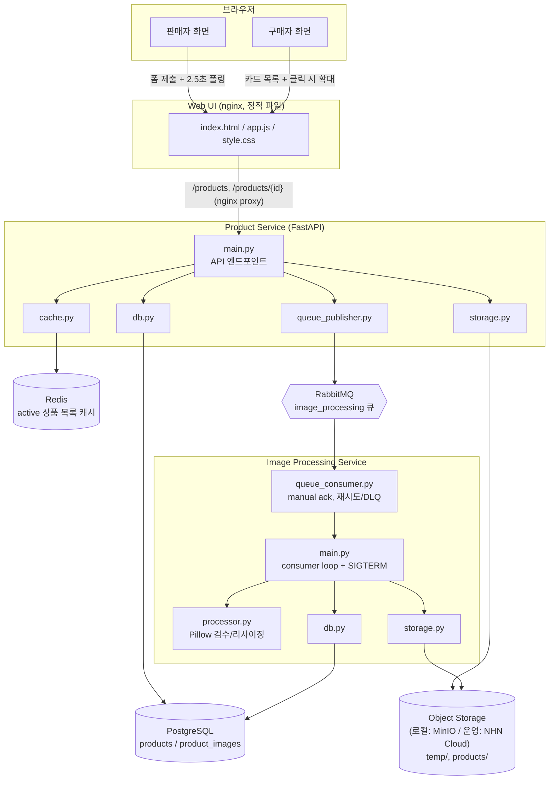
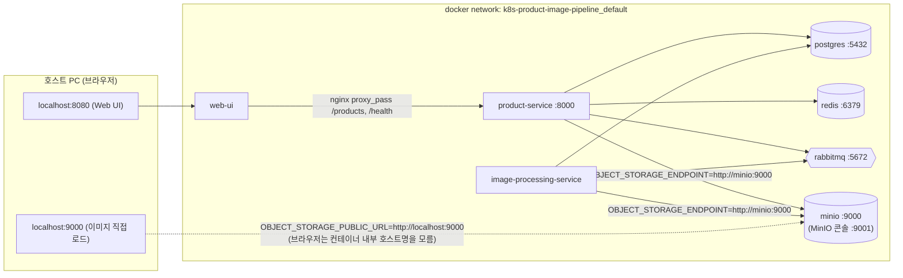
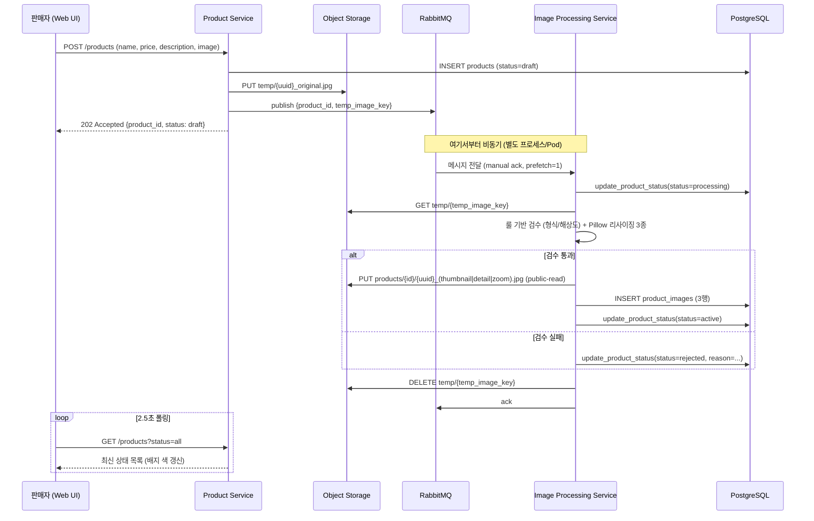
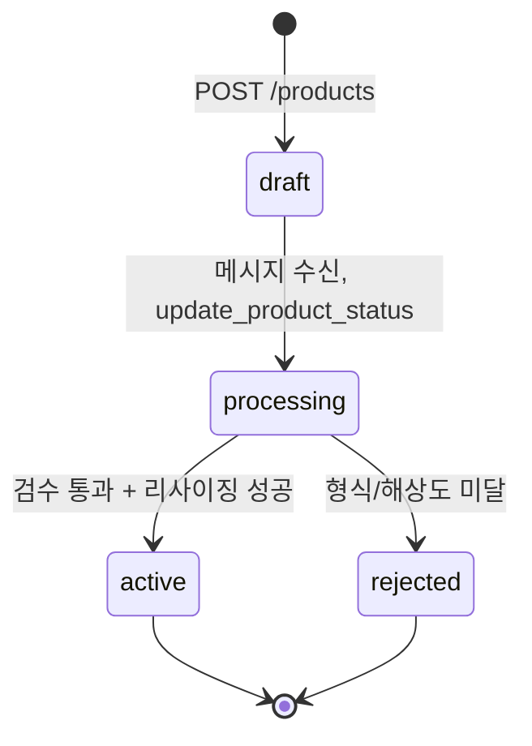
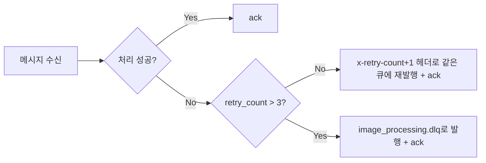
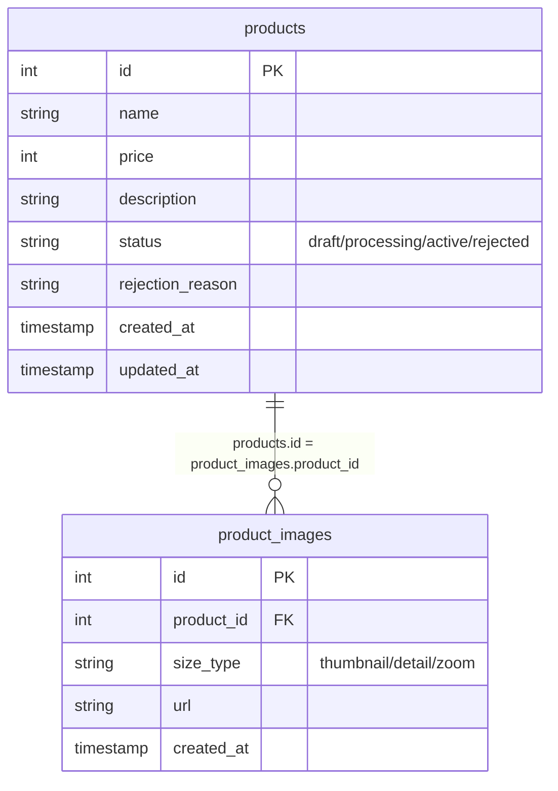
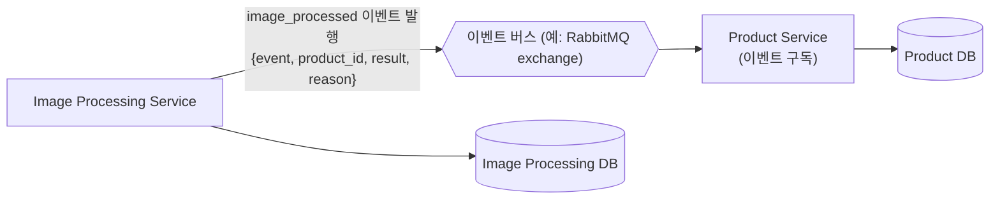

# 아키텍처 문서 (개발 단계) — v0.1.3 기준

> 이 문서는 `v0.1.3` 태그 시점의 코드 구조를 기준으로 작성되었습니다. 이후 버전에서 구조가
> 바뀌면 새 버전에 맞는 `ARCHITECTURE_vX.Y.Z.md`를 별도로 만드는 걸 권장합니다.
>
> **v0.1.2 대비 변경점**: `nginx.k8s.conf`에서 `/health` proxy_pass 블록도 제거했습니다.
> `/health`는 Product Service 전용 엔드포인트라 Web UI의 헬스체크와 무관하고, K8s에서
> Web UI 헬스체크는 `/` 경로만 사용하면 되기 때문입니다 (섹션 8 Web UI 표 참고).
>
> **v0.1.1 대비 변경점**: Web UI 이미지가 기본으로 굽는 nginx 설정을 K8s 실배포 기준
> (`nginx.k8s.conf`, `/products` proxy_pass 제외)으로 바꾸고, 로컬 `docker-compose`는
> 기존 `nginx.conf`를 컨테이너 런타임에 volume으로 덮어써서 그대로 사용하도록 분리했습니다
> (섹션 2, 섹션 8 Web UI 표 참고).
>
> **v0.1.0 대비 변경점**: Image Processing Service의 RabbitMQ 연결 상태 파일 기반 노출
> (`/tmp/healthy` heartbeat)과, 실행 중 연결 끊김에 대한 재연결 while 루프(스펙 9번 항목)를
> 추가했습니다 (섹션 5, 섹션 8 참고).

이 문서는 소스코드가 실제로 어떻게 짜여 있고, 서비스들이 어떻게 상호작용하는지를 설명합니다.
K8s 배포 아키텍처(Helm/ArgoCD/Ingress 구성)는 다음 로드맵 단계에서 `/docs`, `/charts`,
`/argocd`에 별도로 채워질 예정이라 이 문서의 범위 밖입니다. 여기서는 지금 이 리포지토리에
있는 애플리케이션 코드 수준의 아키텍처만 다룹니다.

> 스펙 원문은 [`claude_code_build_instructions_260730.md`](./claude_code_build_instructions_260730.md),
> 테스트 절차는 [TESTING.md](./TESTING.md), 발표용 데모는 [demo/README.md](./demo/README.md) 참고.

---

## 기술 스택

실제로 사용 중인 버전 기준입니다 (`v0.1.0` 태그 시점).

### 애플리케이션 서비스

| 서비스 | 언어/런타임 | 핵심 라이브러리 |
|---|---|---|
| Product Service | Python 3.12 (`python:3.12-slim`) | fastapi 0.115.6, uvicorn[standard] 0.34.0, python-multipart 0.0.20, psycopg2-binary 2.9.10, redis 5.2.1, pika 1.3.2, boto3 1.35.90 |
| Image Processing Service | Python 3.12 (`python:3.12-slim`) | psycopg2-binary 2.9.10, pika 1.3.2, boto3 1.35.90, Pillow 11.1.0 |
| Web UI | 순수 HTML/CSS/JS (빌드 도구 없음), `nginx:alpine`으로 서빙 | Google Fonts(Inter) CDN 1개만 외부 의존 |

### 인프라 구성 요소 (docker-compose 기준 로컬 버전)

| 구성 요소 | 이미지 | 역할 |
|---|---|---|
| PostgreSQL | `postgres:16-alpine` | `products`, `product_images` 저장 |
| Redis | `redis:7-alpine` | `active` 상품 목록 캐시 (TTL 30초) |
| RabbitMQ | `rabbitmq:3-management-alpine` | `image_processing` 큐 소비/발행 (관리 콘솔 포함) |
| Object Storage | `minio/minio:latest` (+ 초기화용 `minio/mc:latest`) | 로컬 전용 — 실제 배포에서는 NHN Cloud Object Storage(S3 호환)로 교체 |

> NHN Cloud 인스턴스는 x86_64(amd64) 기준이라, Apple Silicon 등에서 빌드할 때는
> `--platform linux/amd64`를 명시해야 합니다 (README "빌드 시 주의사항" 참고).

### 버전 갱신 시 확인할 곳

라이브러리/이미지 버전을 올릴 땐 아래 파일들을 같이 확인하세요 — 이 표는 그 파일들의
스냅샷일 뿐, 실제 값의 출처(source of truth)는 항상 코드입니다.

- `product-service/requirements.txt`, `image-processing-service/requirements.txt`
- `product-service/Dockerfile`, `image-processing-service/Dockerfile`, `web-ui/Dockerfile`
- `docker-compose.yml`

---

## 1. 전체 서비스 토폴로지

두 서비스는 PostgreSQL을 공유하지만, 코드/배포 단위(Docker 이미지)는 완전히 분리되어 있습니다
(자세한 배경은 README의 "알려진 기술 부채" 참고).

---

## 2. 로컬 개발 환경 구성 (docker-compose)

로컬 전용으로 추가/변경한 부분 (실제 NHN Cloud 배포 시에는 해당 없음):

- **MinIO**: NHN Cloud Object Storage(S3 호환)를 로컬에서 대체.
- **`OBJECT_STORAGE_PUBLIC_URL`**: 컨테이너 간 통신은 `minio` 내부 호스트명을 쓰지만,
  브라우저가 여는 이미지 URL만 호스트에 노출된 `localhost:9000`을 가리키도록 분리
  (`image-processing-service/storage.py`).
- **`migration` 컨테이너**: `product-service` 이미지를 재사용해 `run_migration.py`만 실행하고
  종료되는 1회성 컨테이너 (K8s Job을 로컬에서 흉내).

---

## 3. 상품 등록 → 처리 흐름 (시퀀스)

`POST /products`가 즉시 `202`를 반환하고 무거운 작업(다운로드/검수/리사이징×3/업로드×3)은
전부 Image Processing Service에서 비동기로 처리되는 것이 이 프로젝트의 핵심 설계 의도입니다.

---

## 4. 상태 전이

역행(예: `active → processing`)은 발생하지 않습니다. 상태를 바꾸는 코드 경로는 오직
`image-processing-service/db.py`의 `update_product_status()` 하나뿐입니다 (아래 6번 참고).

---

## 5. 메시지 처리 재시도 / DLQ 흐름

- manual ack 모드로 동작하며, RabbitMQ 자체 재전송(`nack`/연결 끊김)이 아니라 **재시도 횟수를
  메시지 헤더(`x-retry-count`)에 직접 기록해 재발행**하는 방식으로 최대 3회까지 재시도합니다.
- Image Processing Service가 `SIGKILL` 등으로 강제 종료되면(ack 되기 전), RabbitMQ가 연결
  끊김을 감지해 자동으로 메시지를 재큐잉합니다 — 이건 위 로직과 무관하게 브로커가 기본으로
  해주는 동작입니다.
- `SIGTERM`(정상 종료 신호)은 별도로 처리합니다: 현재 처리 중인 메시지를 마무리한 뒤
  `channel.stop_consuming()`으로 새 메시지 소비를 멈추고 안전하게 종료합니다.
- **RabbitMQ 연결 상태의 파일 기반 노출**: Image Processing Service는 HTTP 서버가 없어(스펙
  7번 항목의 `GET /health`는 Product Service 전용) K8s Liveness/Readiness에 쓸 HTTP 엔드포인트가
  없습니다. 대신 `connect_with_retry()` 연결 성공 직후와, consumer 루프가 살아있는 동안(메시지
  처리마다 + 유휴 시에도 30초 주기로) `/tmp/healthy`(`RABBITMQ_HEALTH_FILE`로 경로 변경 가능)를
  touch합니다. 재연결 재시도가 반복되는 동안은 touch되지 않으므로, `exec` probe가 이 파일의
  mtime 신선도(예: 최근 1분 이내)를 확인하는 방식으로 연결 상태를 판단할 수 있습니다.
- **실행 중 연결 끊김에 대한 재연결(스펙 9번 항목)**: `main.py`의 `main()`이 `connect_with_retry()`
  + `run_consumer()` 호출을 `while not shutdown_requested:` 루프로 감쌉니다. 컨슘 도중
  RabbitMQ 연결이 끊겨 `AMQPConnectionError`/`OSError`가 발생하면 프로세스를 종료하지 않고
  로그만 남긴 뒤 `connect_with_retry()`를 다시 호출해 지수 백오프로 재연결하고 컨슘을
  재개합니다(백오프 로직은 새로 만들지 않고 `connect_with_retry()`를 재사용). `SIGTERM`/`SIGINT`로
  인한 정상 종료는 `run_consumer()`가 예외 없이 리턴하는 경로로 구분되어, 재연결 루프로
  돌아가지 않고 그대로 종료됩니다.

---

## 6. DB 스키마 및 테이블 소유권 (서비스 분리 대비 캡슐화)

| 테이블 | 소유 서비스 | 쓰기 권한 |
|---|---|---|
| `products` | Product Service | Product Service: INSERT(등록) O. Image Processing Service: `update_product_status()` 하나로만 상태 변경 O, 그 외 직접 UPDATE 금지 |
| `product_images` | Image Processing Service | Image Processing Service: INSERT O. Product Service: 읽기(JOIN)만, 쓰기 금지 |

이렇게 캡슐화해둔 이유는 향후 서비스별 DB 분리 + Choreography 패턴 전환을 쉽게 하기
위해서입니다 (7번 참고, 자세한 배경은 README의 "알려진 기술 부채" 섹션).

---

## 7. 향후 확장 아키텍처 (DB 분리 + 이벤트 기반 전환)

지금은 두 서비스가 PostgreSQL을 공유하는 분산 모놀리스에 가까운 상태입니다. 계획된 다음
단계는 아래처럼 DB를 분리하고 이벤트로 통신하는 것입니다 (아직 구현하지 않음 — 스펙
범위 밖, 참고용 목표 아키텍처):

지금 코드에서 `update_product_status()` 함수 하나로 상태 변경을 캡슐화해둔 덕분에, 나중에
이 함수 내부만 "이벤트 발행"으로 교체하면 이 전환이 가능합니다.

---

## 8. 서비스별 코드 구조

### Product Service (`/product-service`)

| 파일 | 책임 |
|---|---|
| `main.py` | API 엔드포인트 (`POST /products`, `GET /products`, `GET /products/{id}`, `GET /health`). 블로킹 DB/큐 호출은 `run_in_threadpool`로 감싸거나 일반 `def`로 선언해 이벤트 루프를 막지 않음 (TESTING.md 5-2 참고) |
| `db.py` | DB 접근 캡슐화 + 재연결 재시도(지수 백오프). `products` 쓰기, `product_images` 읽기 전용 |
| `cache.py` | Redis 기반 `active` 상품 목록 캐싱(TTL 30초) + 재시도 |
| `queue_publisher.py` | RabbitMQ 발행 + 재연결 재시도 |
| `storage.py` | Object Storage `temp/` 원본 업로드 |
| `models.py` | 테이블 소유권 주석 + 상태 enum |

### Image Processing Service (`/image-processing-service`)

| 파일 | 책임 |
|---|---|
| `main.py` | 프로세스 진입점. DB 연결 확립, SIGTERM/SIGINT 핸들러 등록, `connect_with_retry()` + consumer 루프를 감싸는 재연결 while 루프 |
| `queue_consumer.py` | RabbitMQ 소비(manual ack) + 재시도 카운트/DLQ 이동 로직 + `/tmp/healthy` heartbeat(연결 상태 파일 노출) |
| `processor.py` | 룰 기반 검수(형식/해상도) + Pillow 리사이징 3종. LLM 연동 지점 TODO 주석 포함 |
| `db.py` | `update_product_status()` 단일 진입점 + `insert_product_image()` + 재연결 재시도 |
| `storage.py` | 원본 다운로드, 가공 이미지 public-read 업로드(공개 URL 생성), `temp/` 삭제 |
| `models.py` | 테이블 소유권 주석 + 검수 기준/리사이징 스펙 상수 |

### Web UI (`/web-ui`)

| 파일 | 책임 |
|---|---|
| `index.html` | 판매자/구매자 탭, 등록 폼, 이미지 확대 모달 마크업 |
| `app.js` | 폼 제출, 판매자 목록(서버 폴링 기반, `GET /products?status=all`), 구매자 카드 목록, 이미지 확대 모달(사이즈 탭 + 실제 픽셀/용량 표시), 토스트 |
| `style.css` | 배지 색상/펄스 애니메이션, 카드/모달 스타일 |
| `nginx.conf` | 정적 파일 서빙 + `/products`, `/health`를 product-service로 프록시 (로컬 `docker-compose` 전용, 컨테이너 런타임에 volume으로 마운트) |
| `nginx.k8s.conf` | 정적 파일 서빙만 담당, product-service로의 proxy_pass 없음 (`/products`, `/health` 모두 제외) (실배포용, `Dockerfile`이 이미지 빌드 시 기본으로 굽는 설정 — `/products`는 Ingress가 라우팅하고, `/health`는 Product Service 전용 엔드포인트라 Web UI 헬스체크(`/`)와 무관함) |

### 그 외

| 경로 | 책임 |
|---|---|
| `/migrations` | `001_init_schema.sql`(재실행 안전) + `run_migration.py` |
| `/scripts` | `cleanup_temp_images.py` (24시간 이상 지난 `temp/` 정리, 1회성) |
| `/demo` | 발표용 데모 이미지 생성/업로드/초기화 스크립트 (앱 스펙 범위 밖, [demo/README.md](./demo/README.md) 참고) |

---

## 관련 문서

- [README.md](./README.md) — 실행 방법, 환경변수, 완료 기준 검증 결과
- [TESTING.md](./TESTING.md) — 테스트 절차, 재현 명령, 발견된 버그 상세
- [demo/README.md](./demo/README.md) — 발표용 데모 시나리오
